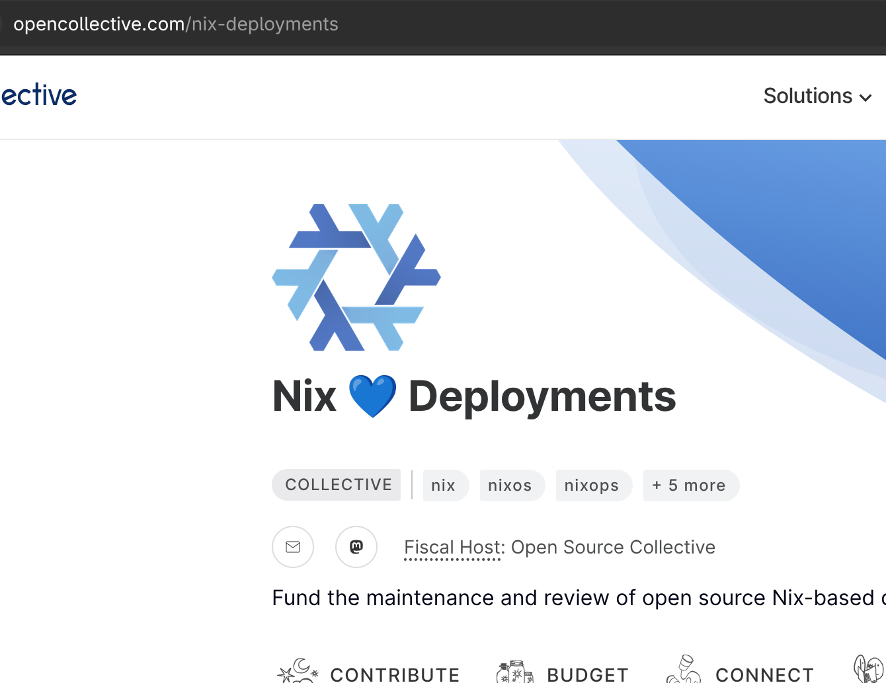

# Introducing NixOps4


<!--
_class: invert lead
-->

@ NixCon 2025

Robert Hensing
GitHub: @roberth
Mastodon: @roberth@functional.cafe

Hercules CI

# @roberth


Robert Hensing

- Hercules CI
- Module system co-maintainer
- Nix team
- flake-parts
- Nix Steering Committee member
- NixOps4
- Modular services

# Thanks

- Nix Deployments on OpenCollective.org
- Fediversity.eu / Open Internet Discourse Foundation

# NixOps4

- Deployment tool
- Successor to NixOps 1 and 2
- WIP

# Deployment Tool

Nix



# NixOps 1

<!--
A bit of history

What is the problem NixOps solves?
-->

2013 - 2020

- NixOps 1 is a tool to deploy NixOS systems
- Provisioning, secrets
- Also resources, e.g. AWS Route53

# Example

<!--
  Here's how a deployment looked like
-->

```nix
{
  machine1 = { resources, machines, config, lib, ... }: {
    deployment.targetEnv = "ec2";
    deployment.ec2 = {
      # ...
    };
    services.nginx.enable = true;
  };
  resources.vpc.<name> = { /* ... */ };
  resources.route53Record.<name> = { /* ... */ };
}
```

# What happened

<!-- but it had problems

Testing and CI are underdeveloped

Big python program,
- difficult to review changes
- probably needed someone to take charge of it

Calling the evaluator twice is both too often and too little, leading to bad workarounds.
  -->
- Testing and CI
- Python setup
- Call Nix evaluator in batch, twice (bad)


# What happened

<!--
- tooling-heavy (mypy coverage ratchet, black, sphinx)
- even more difficult to make changes across plugin boundaries
- no release
-->

NixOps "2"

2020 - ...

- Plugins
- Polyrepo

# What happened

<!--
  This is where I come in.

  - NixOS deserves to have a good provisioning tool
  - For Hercules CI

  Found out about most of the problems.
  This needs to be done differently.
  How? Let's zoom out a little

-->

2021

@roberth

- Still the only tool that integrates provisioning
- Helped with a few PRs
- Project died
- Kept it mostly buildable

# Taking a step back

<!--
  So I had to take a step back. What is it that NixOps does?
  I remember I thought NixOps would be this great Nix-like thing, but it wasn't.

  Nix is a platform, but NixOps was not.
-->

Nix


# NixOps




# 


<!--
  TODO: Explain firmly
-->

# 



<!--

Adds new layer on top, analogous to Nix

Focus on `nix value` => precisely that; no tight coupling between NixOps and its resources

NixOps4 just manages the data flows generically

Another benefit
 - resource can be implemented in any language, with any library

-->


# Resource

- Declares the existence of a real world object
- Operations
  - Create
  - Read
  - Update
  - Delete

# Deployment

Collection of resources
- wired together with Nix expressions
- reflecting some area of the real world

# Operations

- {CRUD} -> Apply

- "`nix run`"
  - backup
  - key rotation

<!--
  a. Arbitrary callable methods in resource provider
  b. Scripts depending on resource outputs 
-->

# Resource Provider

- Program built with Nix
- Called by NixOps
- JSON over stdio
- `nixops4-resources-local`
- `nixops4-resources-tfproto` adapter

# Expressions

Simplified

```nix
{ # flake.nix
  outputs = inputs: {
    nixops4Deployments.default = { resources, ... }: {
      resources = {
        <resource name> = {
          ...
        };
      };
    };
  };
}
```

<!-- These are very abstract. Clarify why. -->

<!-- Next: zoom in on the function -->

# Expressions

```nix
{ resources, ... }: {
  resources = {
    "nixos" = {
      imports = [ inputs.nixos.modules.nixops4Resource.nixos ];
      ssh.privateKey = resources.sshkeypair.privateKey;
      ssh.host = resources.host;
      module = ./configuration.nix;
    };
  };
}
```

# Expressions

```nix
{ resources, ... }: {
  resources = {
    "nixos" = ...;
    "sshkeypair" = {
      type = "ssh.keypair";
      inputs = {
        state = resources.state;
      };
    };
  };
}
```

# Expressions

```nix
{ resources, ... }: {
  resources = {
    "nixos" = ...;
    "sshkeypair" = ...;
    "state" = {
      type = "s3.object";
      inputs = {
        endpoint = "https://garage.example.com";
        bucket = "nixops4-my-project";
      };
    };
  };
}
```

# Expressions

```nix
{ config, resources, ... }: {
  options.customers = mkOption {
    type = attrsOf (submodule ./customer.nix);
  };
  config.resources = {
    "state" = ...;
    "sshkeypair" = ...;
    "nixos" = ... (foo config.customers) ...;
  };
}
```

# Expressions

```nix
{ resources, ... }: {
  imports = [
    ./data-model.nix
    ./applications/pixelfed.nix
    ./applications/mastodon.nix
    ./applications/peertube.nix
  ];
}
```

# Expressions

Sub-deployment nesting

- `resources` monoid in the category of endofunctors :wink:
- Structural composition like `attrsOf` or `submodule`
  - whereas `imports` is mix-ins

```nix
top@{ resources, ... }: {
  resources = {
    "state" = ...;
  };
  deployments = {
    resources."my-host" = { resources, ... }: {
      "sshkeypair" = ... top.resources.state.handle ...;
      "nixos" = ... resources.sshkeypair.privateKey ...;
    });
  };
}
```

# Module author benefits

<!--
  I don't think I have to sell you on All-Nix development experience
  No glue code
   - No custom deployment scripts needed anymore
   - One language
  Incremental deployments
 -->

- All-Nix development experience
- No glue code
- All declarative

# Application benefits

Use case: backend for a deployment service

- Structured logging

- Separate evaluator for stability

- Simultaneously manually operable with shared state

# Demo


# Progress

Built, but subject to fixes and improvements
- `nixops4`/`nixops4-eval` process architecture
- Nix C API, Rust bindings
- Documentation tooling
- Testing
- tfproto: very prototype, needs work

# Progress

to do

- Nesting: support input references everywhere
- TF: Pick apart, test, improve
- Read, Delete
- `nixops4 run`
- Unify `nixops4Deployments.<name>` into `nixops4.deployments.<name>`
- Text User Interface
- Remote state provider implementations (S3, git remote, ...)
- Locking
- REPL
- Check command
- git-crypt + state file = `nixosConfigurations`

# Questions



- opencollective.com/nix-deployments
- nixops.dev
- github.com/nixops4

# Not discussed

- Resource naming within the state
  - read multiple => migrations

- `resourceProviderSystem`

# Process Architecture

- `nixops4`
  - `nixops4-eval` -> `libnixexpr` etc (internal)
  - resource providers
    - `nixops4-resources-local`
    - `nixops4-resources-tfproto`
    - ...

------------------


